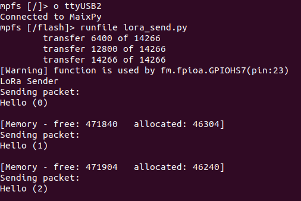

# SP_LoRa Module User Guide

[中文](README_CN.md)

## Directory Structure
| Directory | Description                                   |
| :-------: | :-------------------------------------------- |
|    doc    | Reference documentation                       |
|    img    | Images                                        |
|  script   | Maixpy script example                         |
|    src    | C program example based on the standalone sdk |

## Introduce


The SP_LoRa module uses M-XL8 module with LoRaTM modem and LoRa module with adjustable power amplifier. It has high performance and reliability and is connected by SP_MOD.

*See [Specification](doc/SP-LoRa规格书V1.0.pdf) for more information*

## Pin figure


## Mode connection


|   MCU:FUN(IO)   | SP_LCD |
| :-------------: | :----: |
|  GPIOHS7(IO_7)  |  RST   |
| SPI:MISO(IO_15) |   SO   |
| SPI:SS0(IO_20)  |   CS   |
| SPI:SCK(IO_21)  |  SCK   |
| SPI:MOSI(IO_8)  |   SI   |
|   GPIOH(IO_6)   |  IRQ   |
|    1.8-6.3V     |  3.3V  |
|       GND       |  GND   |

## MCU configuration

### IO port configuration

Configure IO port corresponding to MCU as SPI function pin.

* C

  ```c
    fpioa_set_function(SPI_LORA_SX127X_CS_PIN_NUM, FUNC_SPI1_SS0);   // CS: 20
    fpioa_set_function(SPI_LORA_SX127X_SCK_PIN_NUM, FUNC_SPI1_SCLK); // SCLK: 21
    fpioa_set_function(SPI_LORA_SX127X_MOSI_PIN_NUM, FUNC_SPI1_D0);  // MOSI: 8
    fpioa_set_function(SPI_LORA_SX127X_MISO_PIN_NUM, FUNC_SPI1_D1);  // MISO: 15

    fpioa_set_function(SPI_LORA_SX127X_IRQ_PIN_NUM, FUNC_GPIOHS0 + SPI_LORA_SX127X_IQR_GPIO_NUM); // IQR: 6
    fpioa_set_function(SPI_LORA_SX127X_RST_PIN_NUM, FUNC_GPIOHS0 + SPI_LORA_SX127X_RST_GPIO_NUM); // RST: 7
  ```

* MaixPy

  ```python
    fm.register(20, fm.fpioa.GPIOHS20, force=True) # RST
    fm.register(7, fm.fpioa.GPIOHS7, force=True) # CS

    # set gpiohs work mode to output mode
    cs = GPIO(GPIO.GPIOHS20, GPIO.OUT)
    rst = GPIO(GPIO.GPIOHS7, GPIO.IN)
    # The other pins are configured at SPI initialization time
  ```

### SPI initialization

* C

  ```c
  spi_init(SPI_DEVICE_1, SPI_WORK_MODE_0, SPI_FF_STANDARD, DATALENGTH, 0);
  ```

* MaixPy

  ```python
  spi1 = SPI(SPI.SPI1, mode=SPI.MODE_MASTER, baudrate=100 * 1000,
               polarity=0, phase=0, bits=8, firstbit=SPI.MSB, sck=21, mosi=8, miso = 15)
  ```

## SP_LoRa configuration

### Usage

* Process

  1. Create the LoRa object and initialize it
  2. Send or receive data

* C

  ```c
    sx1278_begin(&SX1278, SX1278_433MHZ, SX1278_POWER_17DBM, SX1278_LORA_SF_8,
                 SX1278_LORA_BW_20_8KHZ, 10);

    if (master == 1)
    {
        printf("====MASTER====\r\n");
        ret = sx1278_LoRaEntryTx(&SX1278, 16, 2000);
    }
    else
    {
        printf("====SALAVE====\r\n");
        ret = sx1278_LoRaEntryRx(&SX1278, 16, 2000);
    }
  ```
  
* MaixPy

  ```python
    lora = SX127x(spi=spi1, pin_ss=cs)
    lora.init()
    
    #######receiver###########
    receive(lora)

    ########sender###########
    # send(lora)
  ```
*See [SX1276_77_78_79.pdf](SX1276_77_78_79.pdf) for more information.*
## Runtime enviroments

| Language |  Boards  |      SDK/Firmware version      |
| :------: | :------: | :----------------------------: |
|    C     | MaixCube | kendryte-standalone-sdk v0.5.6 |
|  MaixPy  | MaixCube |         maixpy v0.5.1          |

## Result

* C

  <center class="third">
	  
  </center>

* MaixPy

  <center class="third">
	  
  </center>

## LISENCE

See [LICENSE](LICENSE) file.

## Other information

| Version |   Editor   |
| :-----: | :--------: |
|  v0.1   | vamoosebbf |