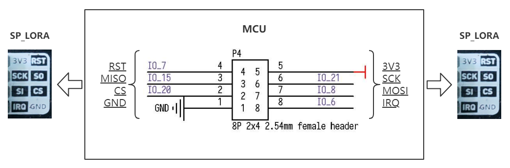

# SP_LoRa 模块使用说明

[English](README.md)

## 目录结构

|  目录  | 描述           |
| :----: | :------------- |
|  doc   | 参考文档       |
|  img   | 图片           |
| script | MaixPy脚本示例 |
|  src   | C裸机程序示例  |

## 介绍

SP_LoRa 模块使用 M-XL8 模组，其内置 LoRaTM 调制解调器和可调功率放大器的 LoRa 模块，具有高性能和可靠性，采用 SP_MOD 进行连接。

*查看[模块规格书](doc/SP-LoRa规格书V1.0.pdf)获取更多特性信息*

## 引脚图


## 接线方式



|   MCU:FUN(IO)   | SP_LCD |
| :-------------: | :----: |
|  GPIOHS7(IO_7)  |  RST   |
| SPI:MISO(IO_15) |   SO   |
| SPI:SS0(IO_20)  |   CS   |
| SPI:SCK(IO_21)  |  SCK   |
| SPI:MOSI(IO_8)  |   SI   |
|   GPIOH(IO_6)   |  IRQ   |
|    1.8-6.3V     |  3.3V  |
|       GND       |  GND   |

## MCU 配置

### IO 口配置

将 MCU 原理图对应的 IO 口配置为 SPI 功能引脚。

* C 示例

  ```c
    fpioa_set_function(SPI_LORA_SX127X_CS_PIN_NUM, FUNC_SPI1_SS0);   // CS: 20
    fpioa_set_function(SPI_LORA_SX127X_SCK_PIN_NUM, FUNC_SPI1_SCLK); // SCLK: 21
    fpioa_set_function(SPI_LORA_SX127X_MOSI_PIN_NUM, FUNC_SPI1_D0);  // MOSI: 8
    fpioa_set_function(SPI_LORA_SX127X_MISO_PIN_NUM, FUNC_SPI1_D1);  // MISO: 15

    fpioa_set_function(SPI_LORA_SX127X_IRQ_PIN_NUM, FUNC_GPIOHS0 + SPI_LORA_SX127X_IQR_GPIO_NUM); // IQR: 6
    fpioa_set_function(SPI_LORA_SX127X_RST_PIN_NUM, FUNC_GPIOHS0 + SPI_LORA_SX127X_RST_GPIO_NUM); // RST: 7
  ```

* MaixPy 示例

  ```python
    fm.register(20, fm.fpioa.GPIOHS20, force=True) # RST
    fm.register(7, fm.fpioa.GPIOHS7, force=True) # CS

    # set gpiohs work mode to output mode
    cs = GPIO(GPIO.GPIOHS20, GPIO.OUT)
    rst = GPIO(GPIO.GPIOHS7, GPIO.IN)
    # The other pins are configured at SPI initialization time
  ```

### SPI 初始化

* C 示例

  ```c
  spi_init(SPI_DEVICE_1, SPI_WORK_MODE_0, SPI_FF_STANDARD, DATALENGTH, 0);
  ```

* MaixPy 示例

  ```python
  spi1 = SPI(SPI.SPI1, mode=SPI.MODE_MASTER, baudrate=100 * 1000,
               polarity=0, phase=0, bits=8, firstbit=SPI.MSB, sck=21, mosi=8, miso = 15)
  ```

## SP_LoRa 配置

### 使用方式

* 流程

  1. 创建LoRa对象并初始化
  2. 发送或者接收数据

* C 示例

  ```c
    sx1278_begin(&SX1278, SX1278_433MHZ, SX1278_POWER_17DBM, SX1278_LORA_SF_8,
                 SX1278_LORA_BW_20_8KHZ, 10);

    if (master == 1)
    {
        printf("====MASTER====\r\n");
        ret = sx1278_LoRaEntryTx(&SX1278, 16, 2000);
    }
    else
    {
        printf("====SALAVE====\r\n");
        ret = sx1278_LoRaEntryRx(&SX1278, 16, 2000);
    }
  ```
  
* MaixPy 示例

  ```python
    lora = SX127x(spi=spi1, pin_ss=cs)
    lora.init()
    
    #######receiver###########
    receive(lora)

    ########sender###########
    # send(lora)
  ```
*更多详细信息请参考[SX1276_77_78_79.pdf](SX1276_77_78_79.pdf).*
## 运行环境

|  语言  |  开发板  | SDK/固件版本                   |
| :----: | :------: | :----------------------------- |
|   C    | MaixCube | kendryte-standalone-sdk v0.5.6 |
| MaixPy | MaixCube | maixpy v0.5.1                  |

## 运行结果

* C

  <center class="third">
	  
  </center>

* MaixPy

  <center class="third">
	  
  </center>

## 许可

请查看 [LICENSE](LICENSE) 文件.

## 相关信息

| 版本号 |   编辑人   |
| :----: | :--------: |
|  v0.1  | vamoosebbf |